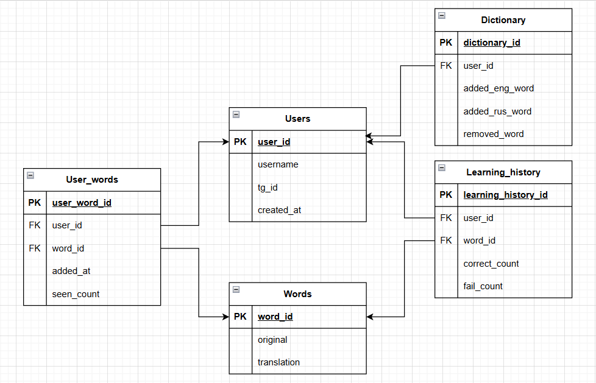

# Telegram бот для изучения английского языка

Telegram-бот для тренировки английских слов с использованием базы данных PostgreSQL. Бот предлагает пользователям угадывать переводы слов и ведет статистику успеваемости.

## Функциональность



- **Тренировка слов**: Бот предлагает 4 варианта ответа для перевода русского слова на английский
- **Автоматическая генерация новых слов**: После правильного ответа автоматически предлагается новое слово
- **Добавление слов**: Пользователи могут добавлять свои слова в словарь
- **Удаление слов**: Возможность удалять слова из словаря
- **Статистика**: Команда `/stats` показывает топ-3 лидеров с количеством правильных ответов и ошибок
- **История обучения**: Все ответы сохраняются в базе данных для анализа

## Структура проекта

```
.
├── bot_instance.py    # Инициализация бота и хранилище состояний
├── config.py          # Конфигурация (токен, DSN из .env)
├── default_db.py      # Создание таблиц и начальное заполнение БД
├── handlers.py        # Обработчики сообщений и команд
├── main.py            # Точка входа, запуск polling
├── models.py          # Модели SQLAlchemy (схема БД)
├── schema.png         # Схема таблиц БД
├── services.py        # Бизнес-логика (пользователи, слова, статистика)
├── validators.py      # Валидация ввода (язык, длина, не пусто)
├── requirements.txt  # Зависимости
└── README.md
```

## Установка

1. Создайте и активируйте виртуальное окружение

2. Установите зависимости:
   ```bash
   pip install -r requirements.txt
   ```

3. Создайте файл `.env` в корне проекта и укажите токен бота и параметры БД:
   ```
   TOKEN=ваш_токен_бота
   DB_HOST=хост_бд
   DB_PORT=порт_бд
   DB_USER=пользователь_бд
   DB_PASSWORD=пароль_бд
   DB_NAME=имя_бд
   ```

4. Создайте первичную базу данных PostgreSQL и выполните инициализацию:
   ```bash
   python default_db.py
   ```

## Запуск

```bash
python main.py
```

## Команды бота

- `/start` - Начало работы с ботом
- `/stats` - Показать статистику (топ-3 лидеров)
- `Тренька!` - Начать тренировку
- `Дальше ⏭` - Перейти к следующему слову
- `Добавить слово ➕` - Добавить новое слово в словарь
- `Удалить слово🔙` - Удалить слово из словаря

## База данных

Используется PostgreSQL. Таблицы:

- **users** — пользователи (tg_id, username)
- **words** — общий словарь (original, translation)
- **dictionaries** — слова, добавленные пользователями (added_eng_word, added_rus_word)
- **learning_history** — по каждому пользователю и слову: счётчики правильных ответов, ошибок и показов

Длина полей «слово/перевод» ограничена (см. `validators.MAX_WORD_LENGTH` и модели).

## Примечания

- Пользователи создаются автоматически при первом обращении к боту
- Статистика считается по таблице `learning_history`; команда `/stats` выводит топ-3
- Ввод при добавлении/удалении слов проверяется: не пусто, нужный язык (английский/русский), ограничение по длине
- Ошибки логируются (модуль `logging`)
